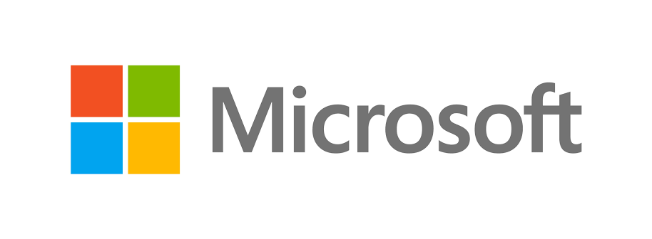

# Tarea de Inicio

## ¿Qué es GitHub?

**GitHub** es una plataforma en la **nube** que permite compartir, almacenar y gestionar **proyectos** de código. Nació en febrero de 2008, donde en 2018 *Microsoft* la compro con acciones en un valor de 7500 millones de dólares

## ¿Qué es Copilot?

Microsoft **Copilot** es un asistente conversacional de *inteligencia artificial* creado por Microsoft, pudiendo realizar lo siguiente.

- Generación de texto: Escribe correos, resúmenes a partir de tus indicaciones
- Generación de imágenes: Genera imágenes desde cero usando descripciones detalladas
- Búsqueda avanzada: Busca información actualizada en internet
- Análisis multimodal: Lee y traduce texto de imagenes o documentos en PDF

